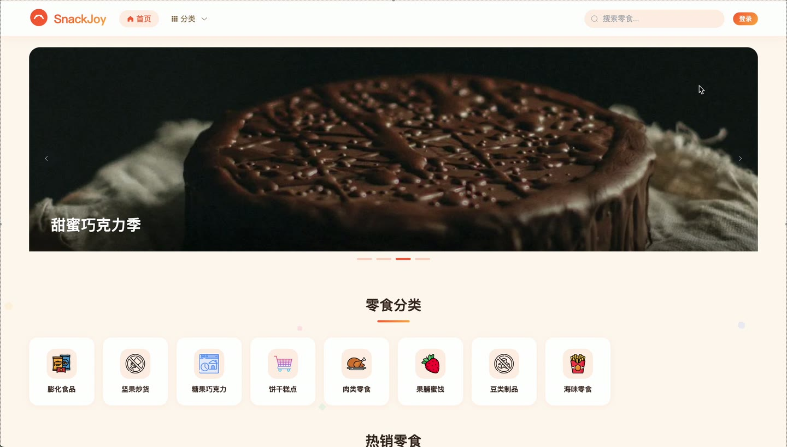
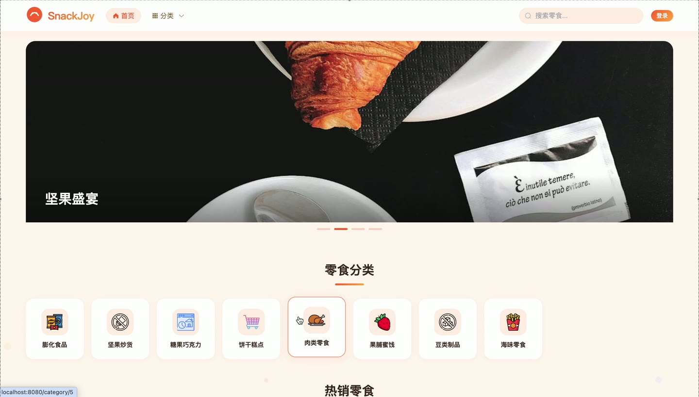
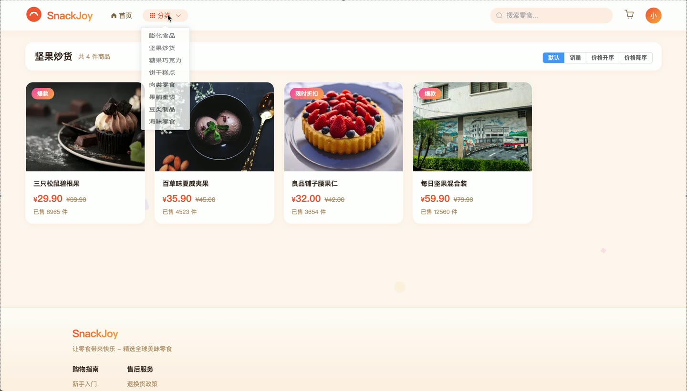

# (附文档)Springboot3+Vue3+MySQL 零食销售商城

**技术栈**：Springboot3、Vue3、MySQL

### 系统简介

SnackJoy 零食销售商城是一套基于 Spring Boot 3 + Vue 3 的前后端分离 B2C 电商系统。系统支持普通用户浏览商品、加入购物车、下单支付、评价商品；商家端管理商品、订单发货、处理退款、回复评价；管理员端审核商家与商品、管理分类与轮播图、查看全站数据看板。系统内置 JWT 鉴权与多角色路由守卫，适合作为中小型零食电商平台的源码交付方案。
 
### 核心功能
 
### 普通用户端

 
- 用户注册与登录：通过用户名/密码注册账号，登录后返回 JWT Token 并自动跳转对应角色首页。 
- 商品浏览：首页展示轮播图、热销商品（按销量降序取前8）、最新商品（按创建时间降序取前8）。 
- 商品列表与筛选：按分类、关键词、价格区间（minPrice/maxPrice）筛选，支持按销量、价格升序/降序排序。 
- 商品详情：查看商品名称、价格、原价、库存、规格、重量、促销标签、主图与多图、分类信息、店铺信息。 
- 加入购物车：选择商品数量加入购物车，同一商品自动累加数量，购物车项支持勾选/取消勾选。 
- 购物车管理：查看购物车列表（含商品信息）、修改数量、删除单项、清空已勾选商品。 
- 下单结算：从购物车勾选商品生成订单，按商家拆分订单（一个商家一个子订单），扣减库存并增加销量。 
- 订单管理：查看订单列表（按状态筛选）、订单详情（含商品项和店铺名）、取消订单（恢复库存与销量）。 
- 订单操作：支付订单（状态变为已支付）、确认收货（状态变为已收货）、申请退款（状态变为退款中）。 
- 商品评价：对已收货订单中的商品进行评分（rating）和文字评价，评价后订单自动变为已完成。 
- 收藏商品：添加/取消收藏，查看收藏列表，检查某商品是否已收藏。 
- 地址管理：新增/编辑/删除收货地址，支持设置默认地址（同一用户仅一个默认地址）。 
- 个人中心：查看/修改个人资料（昵称、手机、邮箱、头像）、修改密码（需原密码验证）。 
- 商家入驻申请：填写店铺名称和店铺描述提交申请，申请后等待管理员审核。
 
### 商家端

 
- 商品管理：发布新商品（需填写名称、分类、价格、库存、主图等，初始状态为待审核）、编辑商品、删除商品、查看商品列表（支持关键词搜索）。 
- 订单处理：查看本店订单列表（按状态筛选），对已支付订单进行发货（填写快递单号和快递公司）。 
- 退款处理：查看退款中订单，同意退款（订单状态变为已退款，恢复库存）或拒绝退款（订单状态回到已支付）。 
- 评价管理：查看本店商品的所有评价，对每条评价进行回复（填写回复内容并记录回复时间）。 
- 库存管理：查看商品列表按库存升序排列，快速修改单个商品的库存数量。 
- 数据统计：查看商品总数、订单总数、待处理订单数、退款数、近30天每日销售额趋势、热销商品Top10。
 
### 管理员端

 
- 数据看板：查看用户总数、商家总数、商品总数、订单总数、待审核商家数、待审核商品数、退款订单数；近100条订单的每日销售额趋势；热销商品Top10；各订单状态（待支付/已支付/已发货/已收货/已完成/已取消/退款中/已退款）数量统计。 
- 用户管理：查看用户列表（支持按用户名/昵称搜索、按角色筛选）、编辑用户状态/角色/昵称、删除用户。 
- 商家审核：查看待审核商家列表（merchant_status=1），通过审核（角色设为MERCHANT，状态设为2）或拒绝（状态设为3）。 
- 商品审核：查看所有商品列表（按状态筛选），通过审核（状态设为1上架）或拒绝（状态设为3下架），删除商品。 
- 订单管理：查看全站订单列表（按状态筛选），含订单详情、买家名称、店铺名称。 
- 评价管理：查看全站评价列表（含评价人昵称和商品名称），可删除评价（将状态设为0隐藏）。 
- 分类管理：新增/编辑/删除商品分类，设置分类名称、图标、排序号、状态。 
- 轮播图管理：新增/编辑/删除首页轮播图，设置标题、图片链接、跳转链接、排序号、状态。
 
### 技术栈

 后端框架Spring Boot 3.x ORMMyBatis-Plus 3.x 权限JWT（jjwt） + 拦截器（AuthInterceptor） 前端框架Vue 3（Composition API + script setup） 状态管理Pinia UI 组件库Element Plus 前端路由Vue Router 4（createWebHistory） 构建工具Vite 数据库MySQL 8.x 文件上传本地文件存储 + MultipartFile
 
### 交付内容

 
- 后端完整源码 
- 前端完整源码 
- 数据库初始化脚本 
- 万字文档

## 界面展示

---

## 获取完整源码 + 万字文档

本仓库为项目介绍页。**完整前后端源码、数据库初始化脚本、万字项目文档**，请加微信 `kangkangcode`，或访问 [codekk.top](http://codekk.top) 获取。

可作课程设计 / 毕业设计参考，支持远程部署调试。